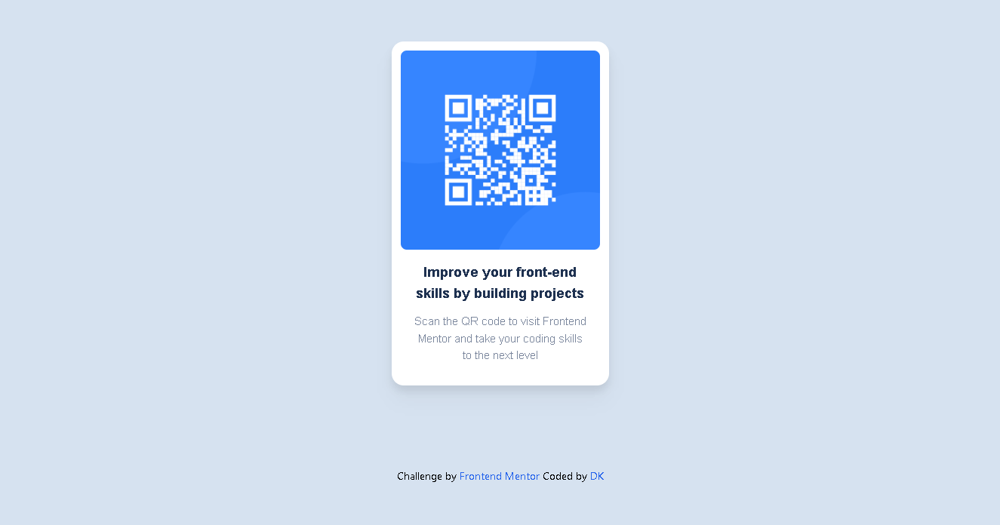

# Frontend Mentor - QR code component solution

This is a solution to the
[QR code component challenge on Frontend Mentor](https://www.frontendmentor.io/challenges/qr-code-component-iux_sIO_H).
Frontend Mentor challenges help you improve your coding skills by building
realistic projects.

## Table of contents

- [Overview](#overview)
  - [Screenshot](#screenshot)
  - [Links](#links)
- [My process](#my-process)
  - [Built with](#built-with)
  - [What I learned](#what-i-learned)
  - [Continued development](#continued-development)
- [Author](#author)

## Overview

### Screenshot

### Links

- Live Site URL: [QR Code App](https://qr-code-dk.netlify.app)

## My process

### Built with

- Semantic HTML5 markup
- CSS custom properties
- Flexbox
- CSS Grid
- [React](https://reactjs.org/) - JS library
- [TailwindCSS](https://tailwindcss.com) - For styles

### What I learned

It's always a challenge make the migrate from pure CSS to TailwindCSS, but I am
very glad to accomplish the challenges, principally working with media querys
and adding a custom font family. With React, it's wondefull working with him,
with small things like this challenge even great works. I love make the
components and how react works!

### Continued development

I need more practice, like everyone else. That's a lot of things that I need to
improve, I need learn more css to make my estilizations more clean and
beautiful, and get deeper in advanceds concepts of React. I wish to work with
this technology, I love it!

## Author

- Frontend Mentor -
  [@DavydKaio](https://www.frontendmentor.io/profile/DavydKaio)
- Twitter - [@ItsTheSimas](https://twitter.com/ItsTheSimas)
